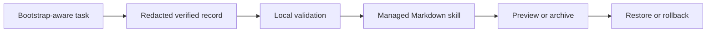

# Oh My Aside

> Alpha: local lifecycle tooling for skills without skill-management chores. It is not an autonomous self-modifying model, semantic evaluator, secure sandbox, or privacy/DLP guarantee.

Oh My Aside lets a bootstrap-aware Aside session submit a small, redacted, verified learning record after reusable work. The dependency-free Node CLI deterministically creates or updates only its own Markdown skills, records replay hashes, snapshots first, archives inactive managed skills, and restores safely. It makes no network calls, needs no API keys, and runs no daemon or scheduler.

**Important boundary:** automation works only inside sessions that honor the installed bootstrap. Normal fresh root-chat global loading remains unverified. A session lifecycle/finished signal is not proof of successful work.



## Quickstart

```sh
git clone https://github.com/sojuhub/oh-my-aside.git
cd oh-my-aside
npm test
node bin/oma.mjs install --account-root "$ASIDE_ACCOUNT_ROOT"
node bin/oma.mjs doctor --account-root "$ASIDE_ACCOUNT_ROOT"
```

Ask Aside to identify the account root and set `ASIDE_ACCOUNT_ROOT` to that verified directory; do not guess it. The copied bootstrap calls its bundled `scripts/oma.mjs`, so no global `oma` command is required. Run the sample learning record only against a throwaway account directory, not your real knowledge base. There is no `curl | bash`. `--account-root` is mandatory for every mutation. Node 20+ is required and no `npm install` is needed.

Initial history backfill is off. Aside may ask once whether to skip history, review selected sessions, or review all eligible sessions. Exclude incognito, ephemeral, sensitive, and unverified material, and submit at most 20 normalized records at a time. This is an agent-guided review, not a bundled history crawler. The CLI never reads raw Aside databases or transcripts.

## Commands

`install`, `uninstall`, `status`, `doctor`, `learn --record FILE`, `backfill --records FILE`, `maintain [--apply]`, `restore --name NAME`, `rollback --name NAME`, and `pin --name NAME [--off]` require `--account-root DIR`. `catalog`, `search`, and `load` delegate the existing hash-aware retrieval payload with that explicit root.

`maintain` previews by default. `--apply` archives only inactive, unpinned, unprotected managed packages, with a default 90-day inactivity threshold. There is no purge. `protectedNames` is an explicit local configuration list; arbitrary dependency scanning is intentionally not claimed. To reuse or refine an archived procedure, `restore` its registered name before `learn`; the coordinator handles these two separate steps.

## Record contract

See [examples/safe-learning.json](examples/safe-learning.json). Records must be successful, verified, reusable, redacted, non-incognito schema version 1 objects. The validator rejects raw/history/auth fields, credential-like strings, personal absolute paths, personal emails, private-key headers, bearer-like text, and permission-bypass instructions. This is a simple heuristic, not DLP. Rejected bodies are never echoed or persisted.

The generated package is only `skills/user/oma-<slug>/SKILL.md`. Exact `taskType` identity deduplicates; a changed verified procedure updates its existing managed skill after a snapshot and hash-drift check. Unmanaged name conflicts fail closed. Markdown procedures only are generated in alpha, never executable scripts or model fine-tuning.

## Local state and safety

Private local state lives under `.oh-my-aside/`: versioned registry/config, event and payload hashes, audit receipts, snapshots, and archives. It stores no raw transcript. Paths are derived from validated identifiers, symlinks are refused, locking is exclusive, and writes use temp-plus-rename. A manual edit blocks automatic update, archive, and rollback. Backups are written before mutation; uninstall removes only matching installer-owned payload/marker and leaves learned skills, snapshots, state, and user edits intact.

The installer adds a short marker-delimited AGENTS block and backs up AGENTS before editing. It refuses an unowned prior `oh-my-aside` prototype and upgrades only files still matching its manifest. Uninstall refuses modified or unexpected payload files instead of deleting them, while preserving edits to the AGENTS marker.

Ordinary operation failures attempt to restore the previous state. An interrupted process leaves a private pending journal and blocks further mutations until reviewed; alpha does not automatically repair crashes or clear stale locks. Never delete a journal or force an overwrite to silence that blocker. Registry and pending-journal writes are limited to 2 MiB and fail before package changes when that limit would be exceeded. Replay fingerprints are not silently discarded.

## Bootstrap recipe

Before work, discover relevant skills, hash-aware load them, and pass common bootstrap to children. After verified nontrivial reusable work, write a redacted normalized record in task scratch, run `learn`, then `maintain --apply` under installed managed-only consent. Skip low-value, failed, private, incognito, sensitive, or unverified work. This grants no publishing, sending, payment, scheduling, or account authority.

A native Aside session API may be used by an integrator to observe lifecycle events and submit a caller-attested normalized record. Label `lifecycle`/`finished` as lifecycle only, not success. There is no public native global completion hook and no instruction here bypasses nested CLI authentication.

The repository includes isolated local fixture tests; these do not prove normal-root loading, provider behavior, token savings, or perfect privacy detection. Earlier retrieval bootstrap testing is referenced only as retrieval behavior, not as proof of global loading.

## Scope and attribution

No guarantees are made about token savings or scanner perfection. Broader semantic consolidation, user-skill mutation, raw-transcript extraction, external actions, and age-based session cleanup are deferred.

Inspired by [NousResearch/Hermes](https://github.com/NousResearch/hermes-agent), particularly its [metadata-first skill discovery](https://github.com/NousResearch/hermes-agent/blob/633dda6d7fdcac7e8340471c9f5ed08cdccbd70c/agent/prompt_builder.py#L1345-L1375) and [explicit skill reading](https://github.com/NousResearch/hermes-agent/blob/633dda6d7fdcac7e8340471c9f5ed08cdccbd70c/tools/skills_tool.py#L228-L258). The implementation here is original. Not affiliated with Aside or Nous Research. Use Aside's in-app help for platform guidance.

See [Korean documentation](docs/README.ko.md), [executed verification](docs/VERIFICATION.md), [architecture](docs/ARCHITECTURE.md), [security](docs/SECURITY.md), and [release checklist](docs/RELEASING.md).
